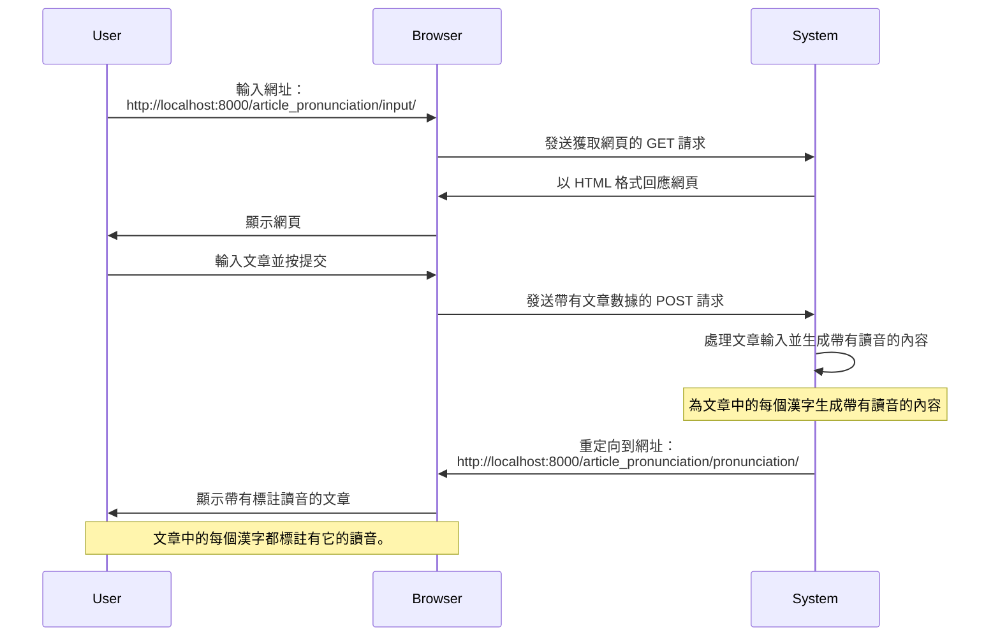
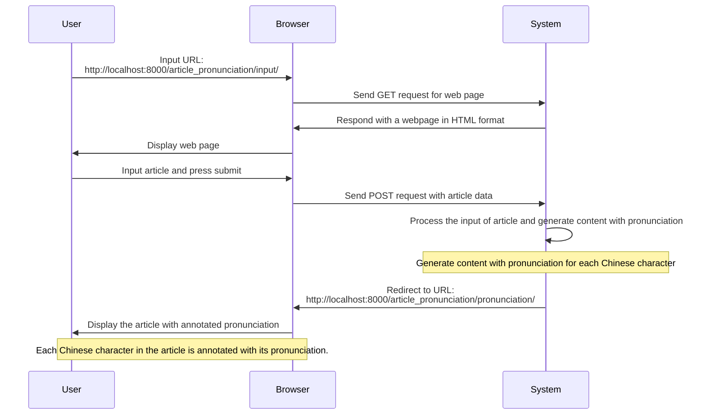

<!-- markdownlint-disable MD024 MD043 -->

# 《功能測試環境建置作業指引》

建立軟體功能測試環境，以下是建立軟體功能測試環境的步驟：

1. **安裝 Python**：確保您的電腦已安裝 Python 3.x。如尚未安裝，請訪問 <https://www.python.org/downloads/> 下載並安裝適用於您作業系統的 Python 版本。

2. **安裝 Python JupyterBook**：在命令提示字元（Windows）或終端機（Mac/Linux）中執行以下指令：

   ```sh
   poetry add jupyterlab --group dev
   ```

   安裝完成後，透過輸入 `jupyter lab` 指令來啟動 JupyterLab。

   ```sh
   poetry run jupyter lab
   ```

3. **安裝 Selenium**：在命令提示字元或終端機中執行以下指令，安裝 Selenium 套件：

   ```sh
   poetry add selenium --group dev
   ```

4. **安裝 Chrome 瀏覽器**：若您尚未安裝 Chrome 瀏覽器，請前往 <https://www.google.com/chrome/> 下載並安裝。

5. **下載 ChromeDriver**：Selenium 需要 ChromeDriver 來與 Chrome 瀏覽器互動。請訪問以下網址，並根據您的 Chrome 瀏覽器版本和作業系統下載適用的 ChromeDriver：<https://sites.google.com/a/chromium.org/chromedriver/downloads>

6. **配置 ChromeDriver**：將下載的 ChromeDriver 解壓縮，並將其檔案路徑添加到您的系統環境變量 PATH 中。

   下載的檔案為 ZIP 壓縮檔，並將執行檔 chromedriver 放入目錄路徑：
   ~/.local/bin/ 中。

   ```sh
   mv ~/Downloads/chromedriver_mac64/chromedriver ~/.local/bin/
   ```

7. **測試 Selenium 與 ChromeDriver 配置**：在 JupyterLab 中建立一個新的筆記本，然後執行以下程式碼：

   ```python
   import time
   from selenium import webdriver

   driver = webdriver.Chrome()
   driver.get('https://www.google.com')
   time.sleep(5)

   assert "Google" in driver.title
   driver.quit()

   print("Selenium與ChromeDriver配置成功！")
   ```

   若您看到"Selenium 與 ChromeDriver 配置成功！"的輸出，則表示您已成功建立軟體功能測試環境。

## 參考資訊

- [下載 ChromeDrive 執行檔](https://sites.google.com/chromium.org/driver/)
- [適用於 Google Chrome V.111 版，ChromeDriver 下載處](https://chromedriver.storage.googleapis.com/index.html?path=111.0.5563.64/)

## 系統功能規格

### 為文章標註漢語讀音

使用者可輸入一段「漢字」，或一篇文章。系統將為每個漢字標註「福建話音標」。

步驟 1：使用者在瀏覽器輸入網址。

【網址】 <http://localhost:8000/article_pronunciation/pronunciation/>

步驟 2：系統顯示「輸入文章」表單。

步驟 3：使用者先在表單中輸入文章，然後按《提交》按鈕。

步驟 4：系統處理輸入之文章，為每個漢字標註「福建話音標」。最後，向使用者顯示已標註福建話音標之文章。
【網址】 <http://localhost:8000/article_pronunciation/pronunciation/>



## Annotating Chinese Characters with Pronunciation in an Article

Users can input a string of "Chinese characters" or an entire article.
The system will annotate each Chinese character with the "Fujian dialect
phonetic notation."

Step 1: The user enters the URL in the browser.

【URL】 <http://localhost:8000/article_pronunciation/pronunciation/>

Step 2: The system displays the "Enter Article" form.

Step 3: The user inputs the article into the form and then clicks the "Submit" button.

Step 4: The system processes the inputted article, annotates each Chinese
character with the "Fujian dialect phonetic notation," and finally
displays the article with annotated Fujian dialect phonetic notation to
the user.
【URL】 <http://localhost:8000/article_pronunciation/pronunciation/>



## Original

- Step 1: User input URL in web browser `http://localhost:8000/article_pronunciation/input/`

- Step 2: System display `Enter Article` form

- Step 3: User input article into form and press submit button

- Step 4: System process the input and redirect to web page in URL and display the content
  which every han_ji (Chinese Character) with pronunction.
  (URL) <http://localhost:8000/article_pronunciation/pronunciation/>

Annotating Chinese Characters with Pronunciation in an Article
Users can input a string of "Chinese characters" or an entire article. The system will annotate each Chinese character with the "Fujian dialect phonetic notation."

Step 1: The user enters the URL in the browser.

【URL】 <http://localhost:8000/article_pronunciation/pronunciation/>

Step 2: The system displays the "Enter Article" form.

Step 3: The user inputs the article into the form and then clicks the "Submit" button.

Step 4: The system processes the inputted article, annotates each Chinese character with the "Fujian dialect phonetic notation," and finally displays the article with annotated Fujian dialect phonetic notation to the user.
【URL】 <http://localhost:8000/article_pronunciation/pronunciation/>


